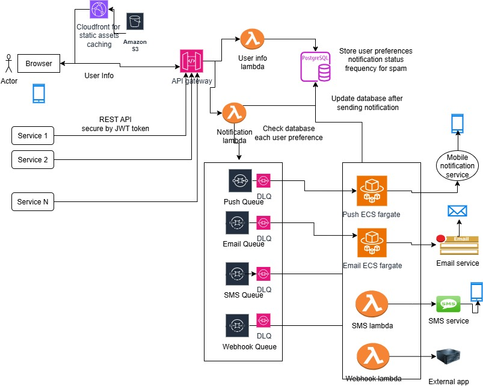

# Notification System App

## Overview

This project is the notification backbone for a platform that must reliably deliver important updates to users across multiple channels—without spamming them. The system is designed to be scalable, resilient, and observable.

## Problem Statement

- The platform currently sends 500K notifications/day (email, SMS, webhook, push).
- Volume is growing 20% month-over-month.
- The existing solution is fragile and does not scale.

## Requirements

- Support multiple channels: Email, SMS, Webhook, Push (web/mobile)
- Respect user preferences and frequency controls
- Ensure delivery with retries and fallbacks
- Scale to 1M+ notifications/day
- Provide visibility into performance and failures (logging, monitoring)
- Expose a minimal API for sending notifications, tracking status, and managing user preferences

## Implementation Notes

- All external service calls (email, push, SMS, webhook) are mocked for testing.
- PostgreSQL queries are written but responses are mocked in unit tests.
- Templates support basic `{{variable}}` substitution.
- Rate limiting and user opt-out preferences are respected.
- Notification status is tracked and exposed via API.

## What We’re Looking For

- Clean, readable code
- Proper error handling and resilience
- Smart architectural choices
- Unit tests for critical functionality
- Documentation of technical decisions

## Questions/Assumptions

- Is this real time?
- supported devices? Laptop, iPhone, android
- for webhooks? simple post to URL’s?
- what trigger notifications? client or server?
- Optout?
- Respect user preferences and frequency controls?
- 1 million per day: 50%push, 30% email, 15% SMS, 5% webhooks

## Architecture

- Separation of Concerns: Lambdas for user info and notification logic, queues for each channel, and dedicated services for delivery.
- Scalability: Queues decouple producers and consumers, allowing horizontal scaling.
- Resilience: Retries and status tracking are built-in.
- Observability: Centralized logging and status updates.
- Queue Backpressure & DLQ:
  - Each queue (Push, Email, SMS, Webhook) has a Dead Letter Queue (DLQ) for failed messages after max retries.
- Idempotency: keys for notification requests to prevent duplicate sends (especially important for retries).
- Rate Limiting & Throttling: can add rate limiting at the API Gateway to prevent abuse and accidental spikes.
- Security: Secure API Gateway endpoints with authentication (JWT, OAuth, etc.).

  - Encrypt sensitive data in transit and at rest (user info, preferences).

- **API Endpoints**

  - `/user`: Register users, set notification preferences
    POST /user
    Register a new user.

        PUT /user/:id/preferences
        Update user notification preferences.

        GET /user/:id
        Get user details and preferences.

        POST /user/:id/devices
        Register a device for push notifications.

        POST /user/:id/webhooks
        Register a webhook for a user.

  - `/notifications`: Send notifications, check notification status
    POST /notifications
    Send a notification (to one or more users).

        GET /notifications/:id
        Get status/details of a specific notification.

        GET /notifications
        List notifications (optionally filter by user, status, channel, etc.).

- `/health`:
  GET /health
  Health check endpoint for monitoring.

- **Channels**
  - Email & Push: Containerized microservices
  - SMS & Webhook: AWS Lambda functions
- **Database**: PostgreSQL
- **Cache**: Redis
- **Retry Mechanism**: Automatic retries for failed notifications
- **Logging**: Centralized logging for all channels

## Tech Stack

- Node.js + TypeScript
- Express.js (API routes)
- PostgreSQL (persistent storage)
- Redis (caching, rate limiting)
- Docker (for containerized services)
- AWS Lambda (for SMS and webhook channels)
- Jest (unit testing)

## Monitoing

- Monitor queue lengths and set alerts for backpressure.
- Use CloudWatch for metrics, logs, and alerts on failures, latency, and throughput.
- Track notification delivery rates and error rates per channel.

## Metrics

Track key performance indicators (KPIs) like:

- Number of notifications sent per channel
- Queue lengths (Push, Email, SMS, Webhook)
- Success/failure rates
- Latency (time to deliver notifications)
- Example: Set up custom metrics in your Lambda, ECS, or application code using the AWS SDK.
